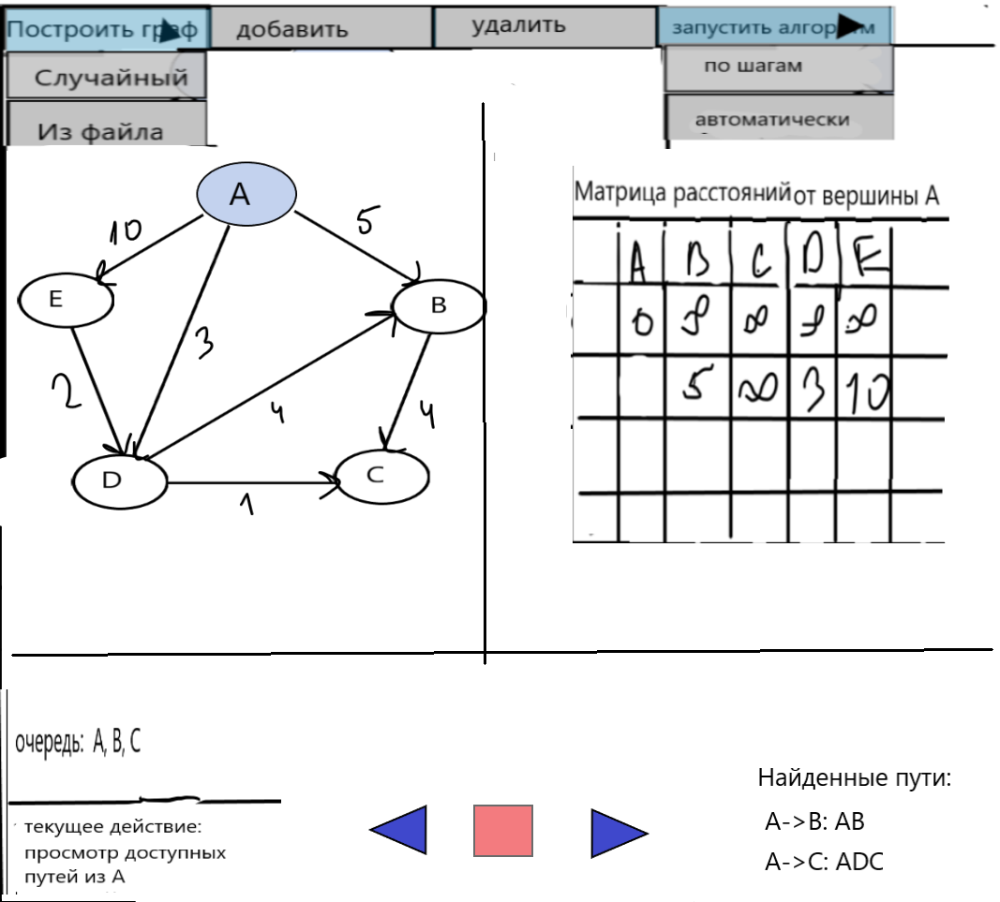
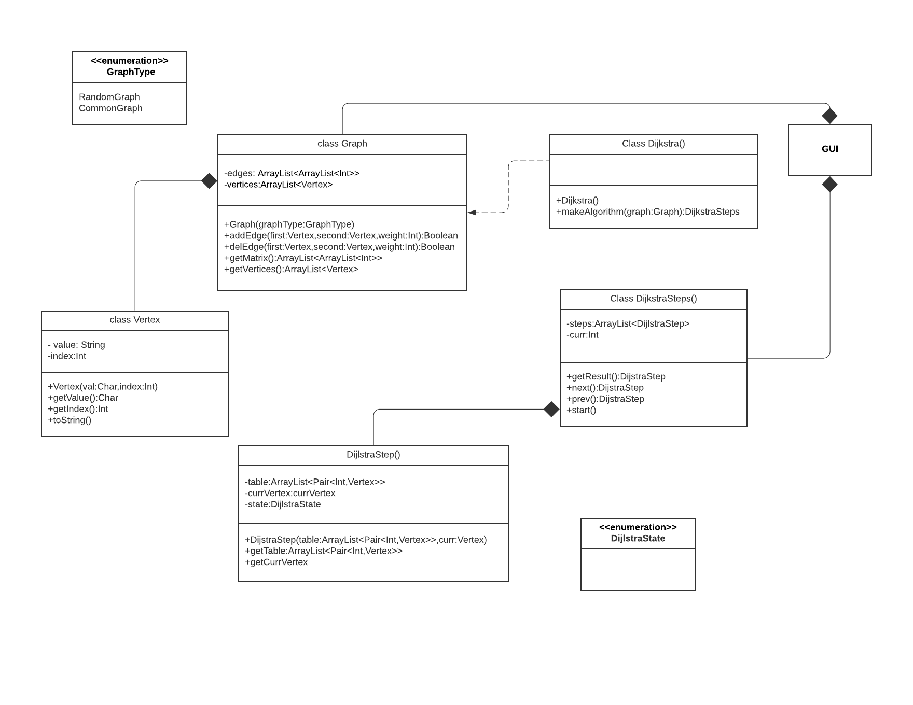
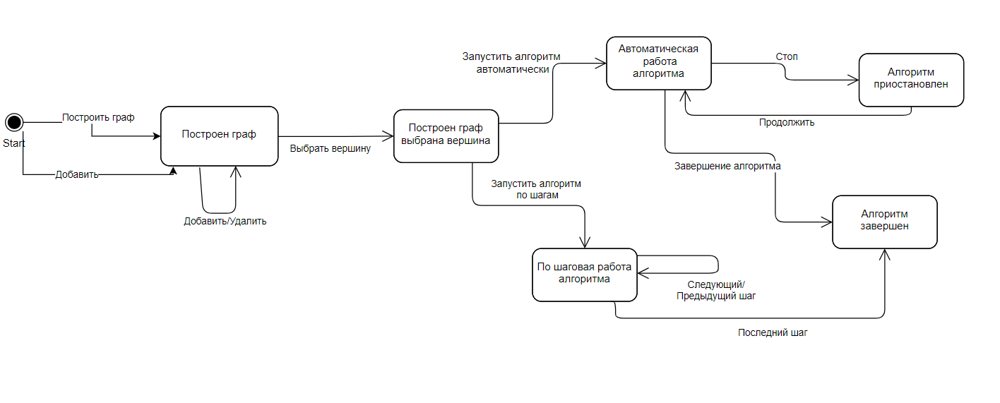
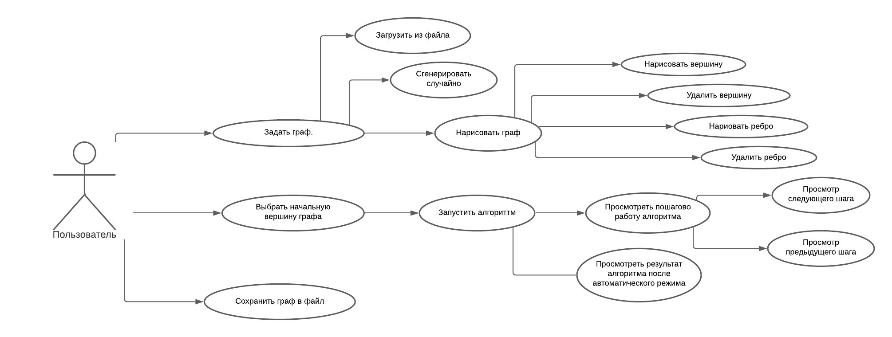

# summerPractice2021
Бригада: 
* Демин Виктор 
* Дерюгин Дмитрий 
* Кузьмин Дмитрий

Группа: 9382

Задача: визуализировать работу алгоритма Дейкстры

# Спецификация

## Описание программы: 
Программа визуализирует по шагам или автоматически алгоритм Дейкстры для поиска путей в графе из выбранной вершины.
Пользователь может ввести граф из файла, или построить с использованием функций программы.
Текущий шаг алгоритм отображается на графе и таблице расстояний от выбранной вершины до других, а также в виде текстовых сообщений
После завершения алгоритма выводятся найденные пути.

### Обработка текущего шага алгоритма:
Каждый шаг алгоритма отображается на графе (например обведение текущей обрабатываемой вершины и ребер, ведущим к ее соседям, в какой-то цвет),
в таблице расстояний от выбранной вершины до других(там появляются новые полученные расстояния) и выводятся текстовые сообщение, например "Обработка вершины A. Просмотр возможных улучшений расстояний"

Будет выводиться на каждом шаге:

<Подсвечивание текущей вершины и ребер выходящих из нее>

<Таблица расстояний от источника и подсветка изменений в таблице в сравнении с предыдущем шагом >

<Текстовое сообщение в зависимости от шага: 1 - обновлен путь, 2 - обработка вершины <имя вершины>>

<Таблица с найденными наименьшими путями на момент шага, с подвсветкой нового добавленного пути>

### Удаление/добавление вершин/ребер:
Удаление/добавление вершин/ребер будет реализовано при помощи контекстного меню. При выборе опции "Добавить" будет выведены две опции "Вершину" и "Ребро". При нажатии на одну и этих кнопок программа перейдет в состояние редактирования графа. Далее в месте клика мыши на область, в которой изображен граф, в зависимости от выбранной операции создастся или удалится вершина. При добавлении вершины выведется всплывающее окно, где нужно будет ввести имя добавляемой вершины. При добавлении ребра необходимо нажать два раза: на начальную и конечную вершину и после этого выведется всплывающее окно, где нужно будет ввести вес ребра.

## Эскиз интерфейса:
  

## UML class diagram
  

## UML states
  

## UML use case
  

## Распределение ролей

| ФИО           | Роль          |
| ------------- | ------------- |
| Демин Виктор  | Реализация алгоритма + тестирование + генератор случайного графа  |
| Дерюгин Дмитрий  | Разработка интерфейса + Визуализация пошаговой работы алгоритма  |
| Кузьмин Дмитрий  | Визуализация графа + взаимодействия с графом  |

## Представление графа в файле
<Количество вершин>

<Матрица смежности>

<Наименование вершин>

Пример представления графа из эскиза:

5

0 5 0 3 10 

0 0 4 0 0 

0 0 0 0 0

0 4 1 0 0

0 0 0 2 0

A B C D E

## План разработки
Пункты:
- [x] Составление спецификации
- [x] Распределение ролей
- [ ] Реализовать прототип
- [ ] Реализовать программное представление графа 
- [ ] Реализовать алгоритм
- [ ] Реализовать визуализацию графа
- [ ] Реализовать визуализацию пошаговой работы алгоритма
- [ ] Добавить генерация случайного графа
- [ ] Тестирование работы алгоритма

| Версии           | Возможности  |  Дата |
| ------------- | --------------- |--------------|
| Прототип  | Интерфейс программы  | 05.07.2021   |
| 1.0  | Запуск алгоритма + визуализация графа +  возможность сохранить и загрузить граф +данные на каждом шаге(Текстовое сообщение в зависимости от шага+Таблица с найденными наименьшими путями на момент шага) | 07.07.2021 |
| 2.0  |  Генерация случайного графа + полный вывод пошаговой работы алгоритма + возомжность добавлять и удалять вершины графа + данные на каждом шаге:(Подсвечивание текущей вершины и ребер выходящих из нее + Таблица расстояний от источника  )| 09.07.2021 |

